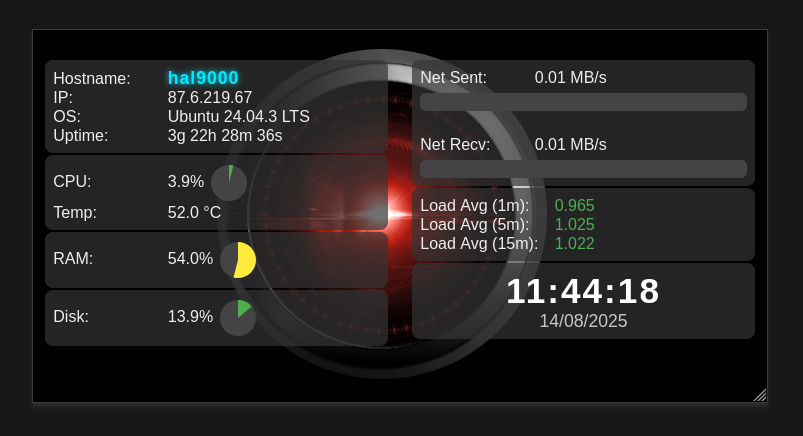

# Phoenix: PeripheralHardwareObserver4ExternalINterfaceeXchange

Reuse old devices as hardware monitors (smartphone and tables) as external Display for Linux systems, with a Python (Flask) backend and a lightweight web frontend compatible with legacy browsers.

## Features
- Real-time display of: CPU, RAM, disk, network, load average, uptime, CPU temperature, hostname, public IP, operating system.
- Web interface optimized for old devices (tablets, netbooks, e-readers, etc.).
- Responsive layout, minimal animations, robust AJAX polling.
- CPU temperature alarm.
- Systemd service management on Ubuntu via manager script.

## Installation
1. Clone the repository:
   ```bash
   git clone <repo-url>
   cd PhoeNix/server
   ```
2. Create and activate the Python environment, then install requirements:
   ```bash
   python3 -m venv phoenixenv
   source phoenixenv/bin/activate
   pip install -r requirements.txt
   ```
3. Start the server:
   ```bash
   cd server
   python phoenix_server.py
   ```
4. (Optional) Install as a systemd service:
   ```bash
   cd bin
   ./phoenix.sh install
   ./phoenix.sh start
   ./phoenix.sh status
   ```

## Usage
- Access the web interface at `http://<server-IP>:5000` from any browser.
- View hardware metrics and system info in real time from your device in kiosk mode


## Structure
   - `server/phoenix_server.py`: Flask backend/API for hardware metrics
   - `web/index.html`: lightweight web frontend
   - `bin/phoenix.sh`: systemd service manager script
   - `bin/phoenix.service`: systemd service file
   - `web/images/hal9000.gif`: animated background

## Requirements
- Python 3
- Flask, psutil, requests (vedi `server/requirements.txt`)
- Linux (tested on Ubuntu and ASUS Zenfone 2 as display)

## Screenshot
(display_example_zenfone.png)

## License
MIT

## Author
Stefano

---
For suggestions, contributions or issues, open one on GitHub!
